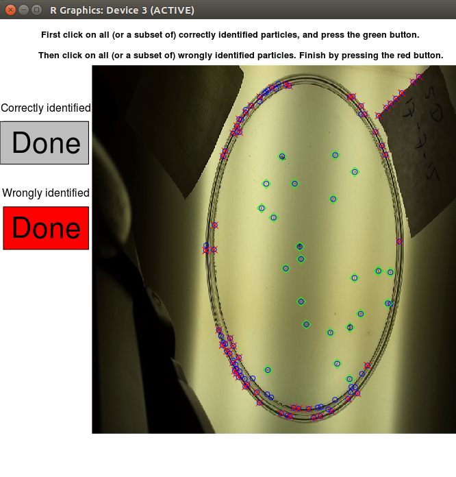

# trackdem

---
Particle tracking and demography
---


This package is currently being developed and tested.

## Abstract


## Dependencies

Final dependencies will be listed here.


## Installation

We are aiming to have a release on [CRAN](http://cran.r-project.org/web/packages/aprof/index.html) soon,
however to install the developmental version from github use the **devtools** package to install the current development version from R.

```r
## devtools is required
require(devtools)
install_github("marjoleinbruijning/trackdem")
```

## Examples

```r

## Load package
require(trackdem)

## Create image sequence
createImageSeq(path='~/Dropbox/Github/trackdem/Test/')

## Load images
direcPictures <- '~/Dropbox/Github/trackdem/Test/ImageSequences/20150406_50/'
loadAll <- loadImages (direcPictures=direcPictures,nImages=1:30)
allFullImages <- loadAll$allFullImages
allFullImagesRGB <- loadAll$allFullImagesRGB
rm(loadAll)

## Create background and subtract
stillBack <- createBackground(
                             allFullImages[,,1,],
                             allFullImages[,,2,],
                             allFullImages[,,3,],
                             dim(allFullImages[,,1,]))
allImages <- sapply(1:3, 
                   function(x) 
	                  subtractBackground(allFullImages[,,x,],
	                  stillBack[,,x],dim(allFullImages[,,x,])),
	               simplify='array')

## Identify particles
seqq <- seq(0,0.01,0.00001)
pthres <- seqq[which(diff(quantile(
                          allImages[,,1,1],prob=seqq)) < 1E-10)[1]]
trackObject <- identifyParticles(allImages,
               pthreshold=pthres,
               pixelRange=c(10,500))

## Track (without machine learning steps)
particleStats <- trackObject$particleStats
records <- doTrack(particleStats=particleStats,
                   plot=FALSE,backward=FALSE,L=100)
pdf('results.pdf')
records2 <- linkTrajec (G=records$G,trackRecord=records$trackRecord,
                        sizeRecord=records$sizeRecord,label=records$label,
                         R=2,plot=TRUE,L=100)
dev.off()


####### TO BE UPDATED ######               
## Prepare data for neural net
nnData <- createNNdata(particleStats=trackObject$particleStats,
                       allFullImagesRGB=allFullImagesRGB,allImages=allImages,
                       frames=NULL,mId=mId,training=FALSE)

## Train neural net
mId <- manuallySelect(particleStats=trackObject$particleStats)

trainingData <- createTrainingData(particleStats=trackObject$particleStats,
                              frames=mId$frame,mId=mId,
                              allFullImagesRGB=allFullImagesRGB,
                              allImages=allImages)

## Choose predictors
predictz <- c("n.cell",'IR','IB','IG',"x","y",'perim.area.ratio')
predictors <- predictz
hiddenLayers <- 6
reps <- 10
n1<-neuralnet(as.formula(paste("D ~ ", paste(predictors, collapse= "+"))),
				data=trainingData,hidden=hiddenLayers,rep=reps)

n1com<-compute(n1,trainingData[,predictors])
Thr <- optThr(stat="F")$maximum
confusion <- table(data.frame(D=trainingData$D,P=plogis(n1com$net.result)>Thr))

## Apply neural net
particleStats <- updateParticles(n1,testData=nnData$testData,
                                 predictors=predictz,Thr=Thr)
                                 


```
## Examples of output
Screenshots to come



