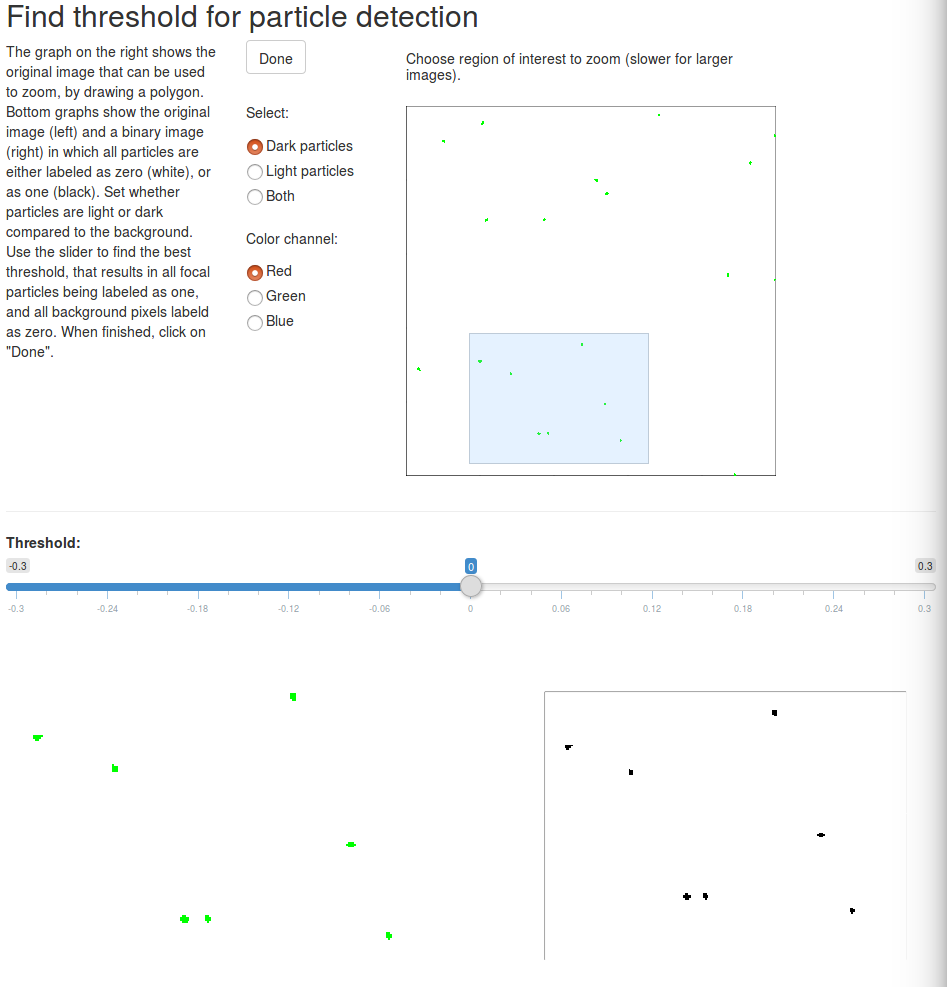

# trackdem (version 0.4.3)
[](http://cran.rstudio.com/web/packages/trackdem)
[](https://github.com/metacran/cranlogs.app)
[](https://github.com/metacran/cranlogs.app)

---
The aim of **trackdem** is to obtain unbiased automated estimates of population 
densities and body size distributions, using video material or image 
sequences as input. It is meant to assist in evolutionary and ecological studies, which 
often rely on accurate estimates of population size, structure and/or 
individual behaviour. The main functionality of **trackdem** 
includes a set of functions to convert a short video into an image sequence, 
background detection, particle identification and linking, and 
the training of an artifical neural network for noise filtering. For more information 
on the package and usage, see our 
<a target="_blank" href="https://besjournals.onlinelibrary.wiley.com/doi/abs/10.1111/2041-210X.12975">article</a> 
that was published in <i>Methods in Ecology and Evolution</i>.

---

<p align="center">
<video src="images/animation2.mp4" width="1002" height="702" controls preload>
</video>
</p>

<!-- TABLE OF CONTENTS -->
## Table of Contents

* [Getting started](#getting-started)  
  * [Installation](#installation)
  * [Tutorial](#tutorial)
* [Updates](#updates)
  * [Version 0.4.3](#version-0.4.3)
  * [Version 0.4.1](#version-0.4.1)
* [Bugs](#bugs)

<!-- GETTING STARTED -->
## Getting started

### Installation
**trackdem** can be installed from <a target="_blank" href="https://cran.r-project.org/web/packages/trackdem/index.html">CRAN</a> or from github.

```r
## Install from CRAN
install.packages('trackdem')

## Install from Github
## devtools is required
require(devtools)
install_github("marjoleinbruijning/trackdem")
```

To use the automated video to image and metadata creation function from **trackdem** users need <a target='_blank' href='https://www.python.org/download/releases/2.7/'>Python 2.7</a>,  <a target='_blank' href='http://www.libav.org'>Libav</a> and <a target="_blank" href="http://www.sno.phy.queensu.ca/~phil/exiftool/install.html">ExifTool</a>.

Ubuntu users can paste the following commands in a terminal to install libav and ExifTool (Python 2.7 should be included 
by default):

```
sudo apt-get update
sudo apt-get install libav-tools
sudo apt-get install libimage-exiftool-perl
``` 

Mac users can paste the following commands in a terminal 
to install libav:

```
## Make sure that homebrew is installed, see: https://brew.sh/
## Install libav
brew install libav
```

ExifTool can be downloaded from <a href='http://www.sno.phy.queensu.ca/~phil/exiftool/install.html'>here</a>. Follow 
the installation instructions for the OS X Package. The newest  
Python 2.7 release, if not installed yet, can be downloaded <a href='https://www.python.org/downloads/mac-osx/'>here</a>. 

Windows users can download libav <a href='http://builds.libav.org/windows/'>here</a>. Download the latest nightly-gpl 
release, and extract all files to a chosen location. Next, download the file 
named libgcc_s_sjlj-1.dll, and place it within the libav directory, 
in '/usr/bin'. ExifTool can be downloaded <a href='http://www.sno.phy.queensu.ca/~phil/exiftool/install.html'>here</a>. For 
ExifTool, download the stand-alone executable and place the 
exiftool(-k).exe file in a chosen directory. For convenience, you can change the name 
to exiftool.exe, as described in the installation instructions. 
Finally, Python 2.7 can be downloaded <a href='https://www.python.org/downloads/windows/'>here</a>. Follow the 
instructions for installation.

<!-- TUTORIAL -->
### Tutorial

A full tutorial is provided with the package (<a href='https://cran.r-project.org/web/packages/trackdem/vignettes/tutorial.pdf'>here</a>).
Some test code to get you started is given below.

```r

## Load package
require(trackdem)

########################################################################
## Simulate image sequence
########################################################################
dir.create('images')
## Create image sequence and save png files to folder 'images' (this takes a moment)
traj <- simulTrajec(path="images",
                    nframes=30,nIndividuals=20,domain='square',
                    h=0.01,rho=0.9,staticNoise=FALSE,
                    sizes=runif(20,0.004,0.006),
                    parsStatic=list(col='blue'))

########################################################################
## Analyze image sequence
########################################################################
## Load images
dir <- "images"
allFullImages <- loadImages (dirPictures=dir,nImages=1:30)
allFullImages
class(allFullImages)
plot(allFullImages,frame=1)

## Detect background
stillBack <- createBackground(allFullImages,method="mean")
stillBack
class(stillBack)
plot(stillBack)

## Subtract background
allImages <- subtractBackground(bg=stillBack)
allImages

## Identify moving particles
findThreshold(allImages)
partIden <- identifyParticles(sbg=allImages,
                              pixelRange=c(1,500),
                              autoThres=FALSE,threshold=-0.1)
summary(partIden)
attributes(partIden)$threshold
plot(partIden,frame=10)

```
<p align="center"></p>

```r
########################################################################
## Reconstruct trajectories
########################################################################

records <- trackParticles(partIden,L=60,R=3)
z <- 1 # minimum presence
summary(records,incThres=z)
summary(records,incThres=z)$N # population count
summary(records,incThres=z)$particles[,"Size"] # body size distribution
summary(records,incThres=z)$particles[,"Total movement"] # movement distribution
dim(records$trackRecord)
dim(records$sizeRecord)
dim(records$colorRecord)

## Obtain results
## Trajectories
plot(records,type='trajectories',incThres=z)
for (i in 1:length(unique(traj$id))) {
  lines(traj$x[traj$id==i],traj$y[traj$id==i],col="grey",
	    lty=2,lwd=2)
}

```
<p align="center"></p>

```r
########################################################################
## Analyze image sequence containing noise
########################################################################
dir.create("images")
## Save png images (red particles are particles of interest)
traj <- simulTrajec(path="images",
                    nframes=30,nIndividuals=20,domain="square",
                    h=0.01,rho=0.9,movingNoise=TRUE,
                    parsMoving = list(density=20, duration=10, size=1,
                                      speed = 10, colRange = c(0,1)),
                    sizes=runif(20,0.004,0.006))
dir <- "images"
allFullImages <- loadImages (dirPictures=dir,nImages=1:30)
stillBack <- createBackground(allFullImages,method="mean")
allImages <- subtractBackground(stillBack)
partIden <- identifyParticles(allImages,threshold=-0.1,
                             pixelRange=c(3,400))
## Select three frames with most identified particles
nframes <- 3
frames <- order(tapply(partIden$patchID,partIden$frame,length),
                decreasing=TRUE)[1:nframes]
## Manually select true and false positives
mId <- manuallySelect(particles=partIden,frame=frames)
## Train neural net
finalNN <- testNN(dat=mId,repetitions=10,maxH=4,prop=c(6,2,2))
## Update and track
partIdenNN <- update(partIden,neuralnet=finalNN)
records <- trackParticles(partIdenNN,L=60,R=3)
summary(records)

```
<p align="center"></p>

<!-- UPDATES -->
## Updates

### Version 0.4.3
* Create log file for function createImageSeq().
* Optimize functions to analyze greyscale images.

### Version 0.4.1
* Enable greyscale image sequences.
* Optimized identification and tracking functions to work with longer image sequences.
* Increased flexibility in function createImageSeq().


<!-- BUGS -->
## Bugs
Bug reports and comments are .
